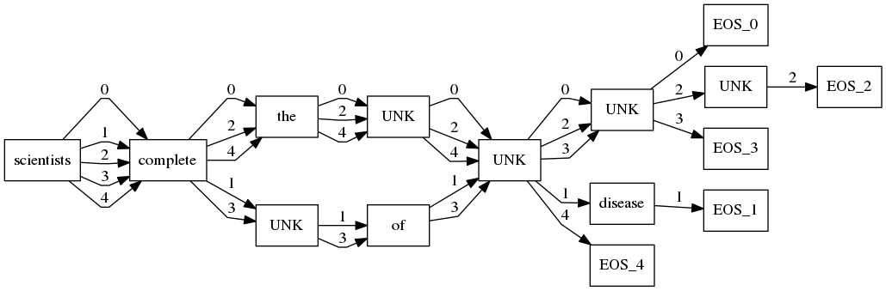

# Visualize Multiple Decoding results

## Requirement

- ubuntu 12.04 or above

- python 2.7.x

- Graphviz
    
    A toolkit for plotting graphs.

- graphviz
    
    Python interface of Graphviz.

## Install

#### install Graphviz

```bash
cd Graphviz
sudo dpkg -i graphviz_2.38.0-1~precise_amd64.deb
sudo apt-get -f install
```
Succeed if ```dot -h``` could give help info.

#### install python interface

```bash
pip install graphviz
```

## Demo

Run
```bash
python demo.py example/result_rnnsearch.iter500000.MT03.en. n
```
n means visualize n-th sentence (start from 1).

n=0:



